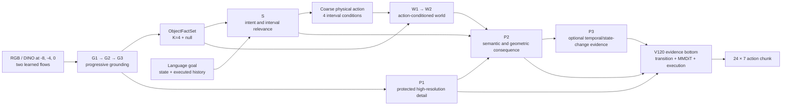

# ClearVLA

面向长时域机器人操作的对象中心 Vision-Language-Action 研究系统。

ClearVLA 将近期多视角视觉、语言目标、机器人状态与已执行动作历史组织成
可审计的对象—意图—世界—策略证据链，并生成 24 步、7 维动作块。项目重点
不是用版本号堆叠实验，而是明确每类证据的所有者、梯度路径、运行时边界和
checkpoint 身份。

> **研究状态：** 本仓库仍处于主动研究阶段，不是稳定的生产发行版。
> [`clearvla/mainline/`](clearvla/mainline/README.md) 是唯一活动实现；旧的
> `Vxx` 启动器、设计稿与日志只用于复现和归因，不能代表当前模型语义。

## 架构一览



- **G** 只处理当前视觉证据，逐级形成局部假设和 `K=4 + null` 的全局对象事实。
- **S** 是唯一的意图所有者，将语言、观测状态和执行历史映射到四个未来区间。
- **W** 只接收对象世界信念与物理动作条件，预测与动作绑定的候选世界。
- **P1/P2/P3** 保留高分辨率事实、选择语义/几何后果，并加入可选时序证据。
- **V120 bottom** 汇合受保护证据、受控转移和执行价值，通过 flow matching
  生成物理动作。

训练期的未来观测只允许进入 detached Teacher 和监督目标；部署路径看不到未来
证据。部署使用两次完整的五步 ODE：第一次生成提案，只重建一次 `W`，第二次从
相同初始噪声生成最终动作。

## 当前身份

| 项目 | 当前合同 |
|---|---|
| Capability | `object_intent_dynamics_323` |
| 活动实现 | `clearvla/mainline/` |
| 基线 manifest | Schema30，Schema28-core recovery 语义 |
| 可选实验 | Schema31 B-spine-0；尚未替代 Schema30 基线 |
| 逻辑拓扑 | `G1 G2 G3 / W1 W2 / P1 P2 P3` |
| 对象空间 | `K=4`，另有显式 null mass |
| 世界区间 | `4-8 / 8-16 / 16-32 / 32-48` |
| 动作输出 | 24 步 × 7 维 |
| 训练方式 | fresh、single-stage、end-to-end |

Schema31 只通过专用配置显式启用；它仍需完成真实 CUDA/BF16、运行时显存和
只读生产 checkpoint 回放等远端门槛。分支名、run tag 和旧实验编号都不是模型
身份，真正的恢复边界由 manifest、解析后的配置、源码摘要和 `run_context.json`
共同决定。

## 快速开始

ClearVLA 使用 Python 3.12 和 [uv](https://docs.astral.sh/uv/) 管理依赖。工作区
本身不作为 PyPI 包发布。

```bash
git clone https://github.com/logwood/ClearVLA.git
cd ClearVLA
uv sync --locked
```

静态检查和轻量测试不会加载训练数据、checkpoint 或完整模型：

```bash
bash scripts/check_static.sh
bash scripts/check_light.sh
```

Windows 对应入口为 `scripts/check_static.ps1` 和 `scripts/check_light.ps1`。
若机器已有兼容的 CUDA Torch，请按
[`docs/development/uv_environment.md`](docs/development/uv_environment.md)
创建桥接环境，避免 `uv` 用不同 wheel 覆盖现有 CUDA 安装。

## 数据与外部资产

仓库不包含训练数据、decoded image cache、DINO cache、T5 条件文件或生产
checkpoint。正式运行至少需要：

1. 原始 HDF5 episode；
2. 与数据身份匹配的 decoded/DINO cache；
3. 与任务映射匹配的语言条件文件；
4. 新建且为空的输出目录。

默认 Pen 配置位于
[`configs/mainline/object_intent_dynamics_323.json`](configs/mainline/object_intent_dynamics_323.json)。
配置中的服务器路径只是当前实验室默认值；迁移到其他机器时，应通过启动脚本
声明的环境变量覆盖，而不是修改模型语义。

## 运行主线

先执行有限批次 smoke：

```bash
CUDA_VISIBLE_DEVICES=0 \
OUT_DIR=runs/clearvla_mainline_smoke \
bash scripts/smoke_mainline.sh
```

确认数据身份、forward/backward、参数所有权和显存门槛后，再从全新目录启动
正式训练：

```bash
CUDA_VISIBLE_DEVICES=0 \
OUT_DIR=runs/clearvla_mainline \
bash scripts/train_mainline.sh
```

现有 checkpoint 只能先走只读验证入口：

```bash
CHECKPOINT=/path/to/checkpoint \
bash scripts/validate_mainline_checkpoint.sh
```

RDT-8 使用独立的
[`scripts/smoke_rdt_multitask.sh`](scripts/smoke_rdt_multitask.sh) 和
[`scripts/train_rdt_multitask.sh`](scripts/train_rdt_multitask.sh)。Schema31
B-spine-0 的显式配置、运行命令与放行门槛见
[`clearvla/mainline/README.md`](clearvla/mainline/README.md)。

## 仓库导航

| 路径 | 用途 |
|---|---|
| [`clearvla/mainline/`](clearvla/mainline/README.md) | 活动模型、训练与部署实现 |
| [`clearvla/action_representations/bspline/`](clearvla/action_representations/bspline/README.md) | B-spline 动作表示与验证合同 |
| [`configs/mainline/`](configs/mainline/) | 可序列化的主线与 outlet 配置 |
| [`scripts/`](scripts/) | 检查、smoke、训练与只读验证入口 |
| [`tests/`](tests/) | 单元、结构、运行时与身份回归测试 |
| [`docs/research/`](docs/research/README.md) | 当前架构合同、问题与研究证据索引 |
| [`legacy/`](legacy/README.md) | 仅供追溯的旧实现入口 |

## 文档阅读顺序

1. [`docs/research/00_CURRENT_ARCHITECTURE_CONTRACT.md`](docs/research/00_CURRENT_ARCHITECTURE_CONTRACT.md)
   — 当前图、ABI、不变量、身份和放行门槛；
2. [`clearvla/mainline/README.md`](clearvla/mainline/README.md)
   — 模块边界、运行参数与入口；
3. [`docs/research/CURRENT_MAINLINE_ISSUES.md`](docs/research/CURRENT_MAINLINE_ISSUES.md)
   — 尚未关闭且可能改变下一步源码的问题；
4. [`docs/research/CURRENT_MAINLINE_REPAIR_PLAN.md`](docs/research/CURRENT_MAINLINE_REPAIR_PLAN.md)
   — 当前实施顺序、对照实验与验收规则；
5. [`docs/research/README.md`](docs/research/README.md)
   — 历史证据和辅助文档的分层索引。

当文档冲突时，以活动源码和对应运行的 `run_context.json` 为最高事实，其次是
当前架构合同。不要从旧文件名、旧 launcher、日志标题或 checkpoint 目录名反推
当前行为。

## Checkpoint 与复现原则

- exact resume 必须匹配 manifest、组件 ABI、源码摘要、配置、数据清单、
  normalizer、语言资产、optimizer 和 RNG 状态；
- pre-recovery Schema29/Schema30 checkpoint 不是当前图的 exact-resume 来源；
- smoke checkpoint 只是门槛产物，不能默认作为正式训练初始化；
- 验证脚本不得写回 optimizer、scheduler、RNG 或新 checkpoint；
- checkpoint、tensor cache、原始日志和完整 probe dump 不进入架构记忆文档。

详细的非协商不变量和最新验收证据始终维护在
[`00_CURRENT_ARCHITECTURE_CONTRACT.md`](docs/research/00_CURRENT_ARCHITECTURE_CONTRACT.md)，
而不是复制到新的版本化说明中。
