# ClearVLA 工作区 WIP 语义地图

更新时间：2026-09-15（Asia/Tokyo）

这是一张**工作区分类图**，不是新的架构合同、训练命令、实验结果或
外部运行授权。它回答“这些改动在语义上属于谁、依赖谁、需要什么证据”，
以便把混合的 WIP 拆成可审查的单元。

## 0. 快照与边界

本次扫描的基线：

| 项目 | 值 |
|---|---|
| branch | `codex/schema29-mainline` |
| HEAD | `e62b1b7` |
| 历史索引所依据的旧快照 | `d585417`（2026-09-05） |
| 已修改 tracked 文件 | 70 |
| 未跟踪、非 `artifacts/` 文件 | 174 |
| 未跟踪 `artifacts/` 文件 | 2,496，约 3.10 GiB |

统计是在创建本文件前取得的；本文件本身是一个新的 review 文档。
`artifacts/`、`.tmp*`、视频、SVG、缓存、checkpoint 和完整 probe dump
不属于架构记忆，也不应随语义单元提交。

权威顺序仍然是：

```text
active source + matching run_context
  > 00_CURRENT_ARCHITECTURE_CONTRACT.md
  > CURRENT_MAINLINE_ISSUES.md / CURRENT_MAINLINE_REPAIR_PLAN.md
  > bounded adapter/design notes
  > history index and archived material
```

本图只做分类，不改变上述顺序；也不复制 handoff 中的 PID、主机、运行目录
或其他易变状态。

## 1. 端到端语义图

```mermaid
flowchart LR
    Raw[raw episodes + annotations] --> Boundary[data/window/action boundaries]
    Boundary --> IDs[data / split / normalizer / cache / language identity]
    IDs --> Online[OnlinePolicyInput]

    Online --> Obs[Observation + G grounding]
    Obs --> Facts[ObjectFactSet<br/>K=4 + camera support + validity]
    Facts --> S[S intent<br/>language + history + typed relevance]
    S --> PAC[PhysicalActionCondition]
    Facts --> W[W world<br/>ObjectWorldBelief + future dynamics]
    PAC --> W

    W --> P1[P1 factual precision]
    S --> P2[P2 interval/type selection]
    P1 --> P2
    P2 --> P3[P3 optional consequence]
    PAC --> Bottom[V120 execution bottom<br/>physical velocity]
    P3 --> Bottom
    P2 --> Bottom
    Step[FlowStepContext<br/>numerical only] --> Bottom

    Bottom --> Field[shared 24 x 18 field]
    Field --> Codec[shared codec + cumulative decode]
    Codec --> Outlet[Pen / RDT / CALVIN / LIBERO adapter]
    Outlet --> Eval[official evaluator or simulator]
    Eval --> Evidence[metrics + run_context + probes]

    Future[FutureSupervision] -. detached target only .-> Teacher[no-grad Teacher]
    Teacher -.-> Evidence
    Spine[B-spine / composite / solver] -. opt-in or diagnostic .-> Bottom
    RL[residual SAC] -. frozen-base adapter .-> Eval
```



图中的实线是默认生产语义；虚线是训练目标、可选实验或外部适配层，不能
反向改变共享核心的 owner。

## 2. 语义 owner 与边界

| 节点 | 唯一主要 owner | 输入 | 输出/责任 | 当前 WIP 位置 | 证据状态 |
|---|---|---|---|---|---|
| Observation/G | `model/observation.py`, `grounding.py`, `top.py` | 因果 RGB/DINO、state、history | `ObjectFactSet`、K/camera 支持和 producer-owned validity | `clearvla/mainline/model/{grounding,top,types}.py` | 接口与局部测试；真实覆盖率/行为仍需看 run |
| S / Intent | `model/intent.py` | T5、observed history、ObjectFactSet | `ActionIntentDock`、语言/历史条件的 interval/K 读取 | `intent.py`, `components.py`, `types.py` | 语言绑定和 all-invalid 聚焦测试通过；多任务行为待证 |
| W / World | `model/dynamics.py` | `ObjectWorldBelief` + `PhysicalActionCondition` | 唯一 future world / consequence producer | `dynamics.py`, `components.py` | 结构边界已有测试；行为责任未重新证明 |
| P1 | `model/components.py`、`v120_core/*` | 完成的 G3、noisy action、detail | 保留 N=49/detail 的 factual precision | `components.py`, bottom/v120 core 改动 | owner-VJP/shape 证据；真实 basis utility 待证 |
| P2/P3 | `model/components.py`, `grounded_intent.py` | S、P1、time、state change | interval/type selection 与 optional consequence | `components.py`, loss/diagnostic 改动 | 不允许用 gain/quota 代替因果证据 |
| Execution bottom | `model/restored_bottom.py`, `v120_core/{time_domain_mmdit,decoder,controller}.py` | physical field、transition、FlowStepContext | instantaneous velocity、terminal heads、两遍 ODE 生命周期 | bottom、runtime、B-spine 改动 | CPU/局部生命周期测试；真实 CUDA/BF16 和曲线待证 |
| Shared codec | `model/action_codec.py`, `v120_core/codec.py`, `data/*` | 共享 24×18 field、normalizer | cumulative decode、action-state 与物理 chart | action chart/physical chart/gripper contract | outlet 边界测试；不能按单一 benchmark 改核心 |
| Outlet adapter | `action_contract.py`, `benchmarks/*`, `runtime/evaluation.py` | native chart、profile、normalizer | Pen/RDT/CALVIN/LIBERO/ManiSkill 的 native conversion 和 metrics | benchmark、config、sampler、evaluation | 协议闭合不等于 learned behavior |
| Identity/lifecycle | `manifest.py`, `config.py`, `runtime/checkpoints.py`, `train.py` | source、data、component、optimizer、sampler | provenance、resume ABI、deployment ABI、atomic output | runtime/checkpoint/config WIP | 需要 round-trip、continuation 和 fail-closed 证据 |
| Evidence layer | `clearvla/tools/*`, `scripts/*`, `tests/*`, docs | 固定 checkpoint/观测/噪声 | probe、matched intervention、报告和 gate | 大量新增脚本/测试 | 只能证明所测边界，不能自动升级 release claim |

### 不可跨越的语义边界

- raw language、color/object pointer、task identity 不进入 W 或 bottom；语言绑定应在 S/P2 编译成既有的 physical carrier。
- future action/state/DINO 只进入 detached Teacher/targets，不能改变 deployed action。
- `FlowStepContext` 是数值积分条件，不是语义对象或 outlet 条件。
- B-spine、composite representation 和 flow-solver 不得偷偷替换 raw path、codec、W rebuild 或输出 ABI。
- validity 是 producer-owned support，不是可学习的 confidence/gain；all-invalid 必须保持有限且有定义的 fallback。

## 3. 当前工作区的语义 lanes

状态标记：`ACTIVE` 默认主线；`PREP` 数据/接口准备；`DIAG` 只读诊断；
`OPT` opt-in 实验；`DOC` 记录；`QUARANTINE` 生成物或暂存物。

| Lane | 语义主题 | 主要路径（代表性，不展开生成物） | 当前判断 | 进入下一步的 gate |
|---|---|---|---|---|
| M0 | workspace、source 与运行身份 | `manifest.py`, `runtime/checkpoints.py`, `config.py`, `scripts/clearvla_workspace.py`, research contract/issues/plan | `ACTIVE`；身份分层已成形，仍有 dirty WIP | 独立 provenance/data/resume/deployment 记录；禁止脏 checkout 启动 |
| M1 | data/window/action boundary | `clearvla/data/{action_chart,physical_chart,hdf5_episode,samplers,split}.py`, `mainline/data/*`, `window_boundaries.py`, `gripper_contract.py` | `PREP`；CALVIN terminal-24、LIBERO causal window、ManiSkill v2 边界已实现 | audit + normalizer/cache/source split identity；再做正式曲线 |
| M2 | language/object binding 与 validity | `mainline/model/{intent,grounding,dynamics,components,types,top}.py` | `ACTIVE` WIP；局部结构闭合，真实行为未闭合 | real checkpoint matched intervention、owner-VJP、invalid-K prevalence |
| M3 | training/lifecycle/sampling/evaluation | `mainline/train.py`, `training/*`, `runtime/{sampling,deployment,evaluation,logging,multitask}.py`, `runtime/flow_schedule.py` | `ACTIVE`；uniform E5 与 Q5 diagnostic 分开 | checkpoint round-trip、同 schedule 训练/部署、完整 loss ledger、CUDA/BF16 |
| M4 | bottom/codec/B-spine | `restored_bottom.py`, `v120_core/*`, `action_representations/{bspline,composite}`, B-spine configs/tests | `OPT`；B-spine/private reader 不改变默认核心 | fixed-checkpoint matched pair、spine-zero、horizon/channel/behavior non-regression |
| M5 | standalone solver | `action_solvers/flow_solver/*`, solver tests, `replay_bspine_schedule.py` | `DIAG`；与 mainline sampler 断开 | identical observation/noise/cache 的 replay、NFE/memory/error/behavior 四类报告 |
| M6 | external benchmark adapters | `clearvla/benchmarks/*`, `action_contract.py`, benchmark configs/scripts/tests | `PREP`；协议工具较完整，学习结果仍未宣称 | official dataset inventory、语言/任务身份、完整 formal curve、closed loop |
| M7 | simulator and residual RL | `clearvla/simulation/*`, `clearvla/rl/*`, `configs/rl/*` | `OPT`；RL 只接 frozen base，不进 mainline trainer | verified demonstrations、BC base success、20-seed baseline、再谈 SAC |
| M8 | probes/tests/research memos | `clearvla/tools/*`, `scripts/probe_*`, `scripts/analyze_*`, `tests/*`, auxiliary memos | `DIAG`/`DOC`；证据层不拥有模型语义 | 每个 probe 标 source/data/normalizer/noise/coverage；结果回 issue ledger |
| M9 | generated output | `artifacts/**`, `.tmp_libero_r4_audit_recheck.json` 等 | `QUARANTINE`；与模型语义分开 | 不进入架构文档或语义 commit；另行归档/清理需明确授权 |
| M10 | presentation tooling | root `make_*ppt.py`, `insert_reflection_slide.py`, `patch_ppt_scope.py` | `DOC/TOOLING`；不代表模型或 benchmark 证据 | 与代码/实验提交分开审查；生成的 PPT/SVG 仍留在 M9 |

## 4. 依赖与提交边界

建议按语义而不是按目录提交。一个可审查的依赖顺序是：

```text
M0 identity/provenance
  -> M1 data/window/action contracts
  -> M2 top owner and validity boundaries
  -> M3 training/deployment/checkpoint lifecycle
  -> M6 one outlet's protocol closure
  -> one matched behavior experiment

M4 B-spine/composite  ─┐
M5 solver diagnostics  ├─ remain separate until the matched gate is selected
M7 simulator/RL       ─┘
```

不要把以下组合放进同一个“cleanup”提交：

- owner/connection 修复 + gain、quota、entropy target 或 loss weight；
- CALVIN/LIBERO/RDT outlet 语义 + shared 18-D codec 改造；
- B-spine + solver schedule + Teacher/W 结构变化；
- benchmark conversion + learned-behavior 结论；
- 代码、完整日志、视频和 PPT 生成物。

## 5. 证据等级与现状

| 等级 | 能证明什么 | 不能证明什么 |
|---|---|---|
| `S` source fact | 当前源码确实有某个边界/owner | 不证明训练学会了它 |
| `T` focused test | 固定 fixture 下接口、shape、finite、VJP 或生命周期成立 | 不证明真实数据频率和任务成功 |
| `R` read-only replay | 固定 checkpoint/观测/噪声下的因果责任 | 不等于 population behavior |
| `C` comparable curve | 同 source/data/normalizer/decoder 下的指标可比较 | 不自动给出机制因果归因 |
| `B` closed loop | 指定 outlet 在指定正式协议下能完成行为 | 不代表其他 outlet 或共享核心都解决 |

本次已直接观察到的局部证据：

- `S/T`：S object read 的语言条件、invalid-K/all-invalid 处理、W object-axis support 的三条聚焦测试通过（`3 passed`）。
- `S`：`ffn_expansion` 到 active decoder 的映射已出现在当前 WIP，但应补一个显式的 resolved-value/parameter-count 测试。
- `R/C/B`：不能从本图推断新的 Pen、RDT、CALVIN、LIBERO 或 StackCube learned score；这些仍由当前 issue ledger 和对应 run context 负责。

## 6. 当前最小风险路径

1. **冻结分类，不清理数据。** 先保留用户的代码和生成物，给每个路径打上 M-lane、owner、是否默认、是否有测试。
2. **先验收已写入的结构单元。** 补 `ffn_expansion` 测试，跑 M2/M3 的 focused + checkpoint/lifecycle gate。
3. **只选一个行为问题。** CALVIN 语言绑定、RDT gripper boundary、Pen far/event 或 LIBERO arm reach 中选一个；不要把四个问题并行改核心。
4. **结果回写现有账本。** 新证据进入 `CURRENT_MAINLINE_ISSUES.md`；稳定架构才更新 contract；历史索引只记录 lineage 和反转。
5. **最后才决定提交/归档。** 生成物、PPT、临时 probe 输出保持在 quarantine；任何 branch/worktree 删除另行做 ancestry 和 recoverability 检查。

## 7. 维护规则

- 每次刷新记录 `HEAD`、branch、扫描时间和统计口径；不要把本图当作永久版本号。
- 新增路径先归入现有 M-lane；只有出现新 owner 或新生命周期才增加 lane。
- 每条行为结论同时记录 source revision、data/split、normalizer、decoder、checkpoint、噪声和覆盖率。
- “实现了”“局部测试通过”“行为改善”“正式闭环”四种状态不可合并。
- 本图不保存 checkpoint、cache、raw log、完整 probe dump、视频或大二进制；只保留路径、职责、gate 和决定性统计。
