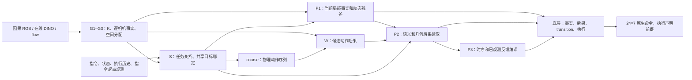

# ClearVLA 当前架构合同

核对日期：2026-10-09 UTC。适用研究主线：
`codex/b-v1-structural-repair-20261008`，以完整 B-v1 为改进底座。
本文件描述选定的 CALVIN 图，不代表仓库内所有历史配置。
源码核对基点：`a206d0481f22eb770f8b307bd7877a43d7f1b056`。
本轮整理只改文档，不改变模型或运行中的实验。

## Agent quick contract

- 当前底座是完成标准闭环的 B-v1。B-v2/v3、地址记忆、SAM 旁线、未来支持域
  修复各有身份与证据，源码可用不等于已合入或已有效。
- 改进面向通用目标区分、语言绑定、空间关系与持续操作。颜色是普通视觉属性
  和一个审计条件；不硬编码颜色、任务、场景或 K 的语义身份。通用且合算的
  SAM 结构可以研究，实际收益仍需验证。
- K、相机、空间、支持域和时间轴保留至明确消费者。当前存在信息压缩问题，
  见[问题表](CURRENT_MAINLINE_ISSUES.md)；不能把这一设计要求写成已实现事实。
- G 组织视觉事实；S 负责意图与共享目标绑定；W 预测候选动作后果；
  P1/P2/P3 编译事实和后果供底层消费。保持各自职责和普通梯度。
- 已实现、机械通过、已训练、行为有效是不同状态。下一步见
  [计划](CURRENT_MAINLINE_REPAIR_PLAN.md)，运行身份见
  [交接](auxiliary/ACTIVE_MAINLINE_HANDOFF.md)。本文件不累积 PID 或探针流水账。

## Authority and document ownership

运行事实由该次运行的源码、解析后配置、`run_context.json` 和 checkpoint
payload 共同确定。冲突时核实工件并修正文档，不从目录名或旧图推断行为。
任务范围与授权以用户当前指示为准；历史“本轮不启动”等话语不是永久禁令。

| 文件 | 唯一维护的内容 |
| --- | --- |
| 本合同 | 当前图、边界、不变量、源码入口 |
| [问题表](CURRENT_MAINLINE_ISSUES.md) | 未决问题、依据、反证与结论范围 |
| [计划](CURRENT_MAINLINE_REPAIR_PLAN.md) | 下一步交付、顺序、完成标准 |
| [交接](auxiliary/ACTIVE_MAINLINE_HANDOFF.md) | 路径、身份、带时间戳的状态 |
| [研究账本](G_SLOT_IDENTITY_BINDING_REVIEW.md) | 按需检索的历史证据与复现依据 |

## Default and opt-in selections

这里的“底座”特指 B-v1 运行，不是 `config.py` 的所有默认值。
完整配置以工件为准；地址记忆等候选须单独声明。

| 边界 | B-v1 选定语义 |
| --- | --- |
| 视觉 | 双相机 top/wrist，冻结 DINOv3 ViT-B/16，`dinov3_online_v1` |
| 存储 | `hdf5-direct`、RGB LRU=0、`dino_cache=""`；不读 RGB/DINO 值缓存 |
| 因果时间 | 图像/状态时刻 [-8,-4,0]；已执行动作有独立真实时钟和有效性 |
| G | K=4 加 null；`canonical_image_v1`；逐相机值与空间分配 |
| S | `joint_object_scene_v1`、`shared_operation_v1`、`full_tokens_views_v1` |
| W | `sequence_prefix_v1`、`known_prefix_v1`、`observed_state_views_v1` |
| 未来区间 | [0,4] / [4,8] / [8,16] / [16,24]；端点 4/8/16/24 |
| 测量/反馈 | `source_consistent_v1`、`executed_four_step_world_v1`、`before_proposal_v1` |
| P2/P3 | `s_conditioned_values_v1`、`view_conditioned_transport_v1`、`typed_horizon_v1` |
| 底层 | V120 evidence MMDiT、`p3_compiled_task_v1`、transition/workspace/execution |
| 出口 | CALVIN 24×7 相对命令；arm 适配与 binary gripper command 分开 |
| 采样 | Q5 提案 → 一次 W 重建 → 同初始噪声 Q5 精化，完整预算 |
| 身份监督 | `rgbd_temporal_v1`；仍有已证实的 null 捷径 |

旧 `decoded_cache` 等字段存在不表示在线路径读取它。
当前决策内静态复用与持久 RGB/DINO 值缓存是不同生命周期。
紧凑辅助监督标签有独立来源、覆盖和生成成本，不是特征缓存。

## Active graph

### G：事实与对象候选

G 组织视觉及因果视觉历史，不读语言、未来标签或当前 ODE 噪声动作。
局部假设、全局 K、null 各有分配；K 不天然对应固定物体或颜色。
K 坐标是相机内读分布重心，不是已经校准的世界物体坐标。
身份需由真实物体覆盖、跨时间/视角对应和目标读取验证。

### S：指令、共享目标与任务关系

`TaskConditionedTargetBinder` 让完整任务 token 与逐相机内容、语义、外观、
几何交互，产生支持 K 加 null 上的一份绑定。历史可调节任务读取，不可单靠
历史伪造任务身份。语义与几何消费者共享 K 边缘，几何保留相机选择。
没有红蓝粉专属分类头或固定 K→颜色表。

S 表达任务区间、指令起点关系、已发生结果和期望结果，这些语义不能互换。
当前坐标特征在任务读取前有已复现的表达零空间；计划中的 S 修复尚未落地。

### W：动作后果与观测反馈

W 接收 G 世界事实、声明的已观测机器人/相机条件及已知物理动作前缀，
不直接读原始语言、S 隐状态、未来 Teacher 或 ODE 噪声动作。
W1/W2 输出动作身份配对的未来语义和逐相机几何。

当前完整图像 law 尚未贯穿 `ObjectWorldBelief/FutureObjectDynamics` 至显式
P2 几何读取；中心、平均运输、协方差不能恢复丢失的信息。
correspondence unknown、G ownership null、S binding null、endpoint null
是不同量。长间隔 current→instruction-start 匹配与遮挡仍未解决。

### P1/P2/P3 与底层

P1 在实际支持位置读取局部细节后汇总，静态事实与动作/时间残差分开。
候选大小由生产者声明，旧 N=49/64 不是所有配置的通用常数。
P2 读取 W 的语义/几何后果并保留物理区间；P3 编译时序和反馈。
protected-detail 已混合目标事实与后果，不能叫“纯视觉细节贡献”。
MMDiT、CVAE/workspace、transition、capacity 和执行路径继续存在。

## Training, deployment and runtime

训练在线图与独立未来监督有明确边界。冻结编码器/Teacher 与可训练消费者的
梯度规则不同；在线可训练证据保留普通 autograd。未来标签不进入部署观测。
RGB-D、运动学、RGB 对应可作有来源的训练监督；模拟器 body ID、真实物体位姿、
审计 mask 只作评估 oracle，不得决定训练配对、前景或在线目标。

一次观测准备 G/S/静态 P1/反馈；提案采样后只重建一次与提案配对的 W，
再从同一初始噪声精化。端点 head 不再推进动作。静态复用不能跨越模型、
观测、指令、时间或模式身份；ODE 时间与物理控制时间独立。

CALVIN canonical field 为18维，原生命令为7维。arm 的 value/delta 按出口
合同解码，夹爪使用 binary command head。arm-only flow/decoded 指标不能
冒充夹爪命令指标。控制器锚点和执行前缀由 evaluator 明确声明。

## Non-negotiable invariants

1. K、相机、候选、类型、区间、时域和支持保留至消费者。对压缩值做 expand
   不能宣称恢复原证据。
2. 在线可训练路径用普通梯度，每参数有一个 optimizer owner。Teacher/no-grad
   显式声明；激活 VJP、参数梯度、权重更新和行为收益分开核验。
3. 支持由对应生产者提供。置信度、份额、learned null 不能替代物理有效性
   或训练标签依据；全无效输入具有明确有限输出。
4. S/G/W 职责、共享 K+null 边缘、相机坐标身份保持明确。
   数值 flow-step 条件不等于语义条件。
5. 固定在线输入、权重、噪声时，替换未来标签不能改变部署输出。
   未来数据仅进入声明的训练目标或 matched supervision。
6. 已知动作前缀、回执、时钟和 instruction/environment reset 保持真实。
   缺失不能伪装成零值事实；动作转换由出口 adapter 所有。
7. P1 先在真实位置读取；P2 零后果保持中性，物理区间不加虚构 null。
   当前 law、未来预测 law、坐标摘要不混淆。
8. lane 置零不是独立贡献百分比；K 交换不自带物体身份。
   指令响应须核对重复噪声和正确性；幅度变大不是通用能力证明。
9. 关闭 RGB/DINO 值缓存，公开完整预算及资源成本。不得用删预算、隐式缩图、
   丢信息或未声明 batch/exposure 变化伪造提速。显存门槛按实际设备与任务判断，
   不继承历史某次22 GiB的通用自动停止规则。
10. 精确恢复、显式迁移、只读验证分开。固定运行 checkout 不热改，失败证据保留。
    修改声明配置/ABI并验证其兼容性。

## Identity and checkpoint contract

核验源码/组件 ABI、解析配置/digest、数据划分、语言及 normalizer 身份。
精确续训还要求 optimizer、schedule、RNG 和执行时钟符合恢复合同。
参数继承不等于优化器/时钟继承；迁移时逐项声明。

开发源码已在离线验证前原子保存 `training_complete.pt`，携带
`validation_pending`。它保护完成的训练权重，不等于通过验证的 best/latest。
普通精确 resume 拒绝待验证快照；只读验证可用。这个修复不能恢复旧两短跑
已经丢失的最终权重。具体实验身份由交接文件维护。

## Source map

入口均相对仓库根目录，按当前边界查阅：

| 边界 | 目录（相对仓库根） | 文件 |
| --- | --- | --- |
| 配置/身份 | `clearvla/mainline/` | `config.py`、`manifest.py`、`checkpoint.py` |
| 组合 | `clearvla/mainline/model/` | `policy.py`、`top.py` |
| 在线视觉/G | `clearvla/mainline/model/` | `restored_observation.py`、`grounding.py` |
| Flow/DINO数值实现 | `clearvla/mainline/v120_core/` | `flow_dino_evidence.py` |
| S/绑定 | `clearvla/mainline/model/` | `intent.py`、`task_execution.py`、`target_binding.py` |
| 当前测量/指令起点 | `clearvla/mainline/model/` | `source_measurement.py`、`instruction_posterior.py` |
| 期望监督 | `clearvla/mainline/` | `annotation_goal.py` |
| W/P2/P3 | `clearvla/mainline/model/` | `dynamics.py`、`compiler.py`、`horizon_coordination.py` |
| P1/底层/出口 | `clearvla/mainline/model/` | `v120_p1.py`、`restored_bottom.py`、`transition.py`、`action_codec.py` |
| 采样 | `clearvla/mainline/runtime/` | `sampling.py` |
| 训练/日志 | `clearvla/mainline/` | `training/`、`runtime/`、`train.py` |

旧合同及早期图从[归档索引](archive/README.md)按需检索。
研究账本解释修复缘由，不能覆盖实际运行选择；验收流程由计划文件维护。
