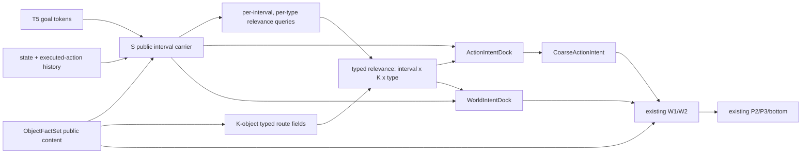

# ClearVLA S 对象/类型所有权受控收口计划

状态：**Schema25 源码实现与本地审查完成；CUDA smoke 和完整八轮 gate 待执行**
更新：2026-08-20

本计划只处理 [`CURRENT_MAINLINE_ISSUES.md`](CURRENT_MAINLINE_ISSUES.md) 中与 S 输入、输出和必要消费边界直接相关的故障。源码已切换到 Schema25；“实现完成”只表示结构与本地数值 gate 已通过，不代表 fresh 实验已经证明动作收益。

## 实施结果

- `StatelessIntentBundle` 及四个 consumer docks 已接入；public carrier 与 `[interval,K,type]` typed relevance 分离。
- 三种类型各自使用固定零 null；未增加 entropy、mass、diversity 或 progress loss。
- CoarseAction 与 W 的 raw typed reread/shared learned-null router 已删除；W1/W2 block、预测头、P1/P2/P3、transition 和 bottom 内部未重写。
- manifest 已升至 Schema25，旧 Schema24 checkpoint 不能 exact resume。
- 当前参数为 `169,981,895 total / 153,587,574 trainable`；相对 Schema24 的 `-12,731,133` 全部来自已列明的重复 readers/routers，bottom 和 exact P1 参数量不变。
- 122 个 mainline 测试通过，包括 CPU BF16 forward/backward、optimizer ownership、K permutation、typed-owner relabeling、per-type 扰动局部性、fixed-zero value、public-target 梯度隔离、部署与 checkpoint 边界；连同日志审计测试共 153 项通过。
- 本机 GPU 可见，但当前 uv 环境为 CPU-only PyTorch，无法执行 CUDA gate；服务器 CUDA smoke、batch-8 显存/吞吐测量和完整八轮行为 gate 仍待执行。在这些结果返回前，不宣称 S 修复提高了 RMSE、gripper 或中远程动作。

## 一、完整八轮对原计划的修正

完整日志给出了三个必须写入实施边界的结论：

1. **S 的结构故障确定存在。** 当前 S 在形成 typed innovation 前丢掉 K 对象轴，并让 semantic、appearance、geometry 与同一个 null 竞争；CoarseAction 与 W 随后又各自重读 typed facts，所以 S relevance 不是唯一意图来源。
2. **S 不是已被证明的 epoch 7/8 回归根因。** 当前 physical RMSE 在 epoch 6–8 为 `0.08008 / 0.08193 / 0.08218`；回归集中于 gripper 和 5–24 步。同期 S typed innovation 从 `0.00350` 回到 `0.01004 / 0.00860`，W interval 指标也没有突变。V120 自身也在最后一轮回升约 `2.65%`。
3. **不能通过继续放大 W/P2 来补 S。** epoch 6→8 的 P2 null mass 从 `0.1270` 降至约 `0.0946`，consequence effect RMS 增长约 `10%`，但动作验证反而回退。这只构成验收护栏，不构成重写 P2/P3 的授权。

因此本轮目标是消除确定的所有权与旁路故障，同时严格保持现有动作能力。只有 fresh 八轮同时显示 gripper 与中远程验证改善，才可以声称本轮缓解了晚期回归。

## 二、锁定范围

### 允许修改

- `clearvla/mainline/model/intent.py` 中 S 的 public/typed 组织和 CoarseAction 的 typed 输入。
- `clearvla/mainline/model/types.py` 中 S-owned typed interfaces 与 consumer docks。
- `clearvla/mainline/model/dynamics.py` 中 W 对 S typed relevance 的最小输入接线。
- `top.py`、训练日志、manifest、测试和当前文档中为上述接口迁移所必需的最小改动。

### 禁止扩张

- 不修改 G1/G2/G3 内部、Teacher、P1/P2/P3、transition、CVAE、workspace、Evidence MMDiT、execution 或 bottom。
- 已确认的 G3 anchor→transition 问题继续单独挂账，本轮不同时修复。
- 不改变 action/future loss 外部权重，不新增 block、辅助 loss、gain、quota、entropy target、hard gate 或人工梯度。
- 不以降低 P1 精度、高分辨率带宽或 bottom 容量来迫使 S 显得重要。

## 三、目标语义

S 仍是无状态意图组织器，不是阶段分类器。它回答两个不同问题：

- `public_interval_carrier`：在目标、可观测历史和当前公共事实下，四个时间区间的公共意图是什么；
- `typed_relevance`：在每个区间内，哪个对象的 semantic/appearance/geometry 事实与意图相关。

公共信息和 typed relevance 不再提前相加成一个信息汤。S 不承载完整 DINO/raw 内容；完整事实仍由 `ObjectFactSet`、P1 和 W 的既有字段持有，S 只组织可观察的相关性。



## 四、锁定接口

新 S 边界使用单一 `StatelessIntentBundle`：

```text
protected_goal_memory       [B,G,H]
public_interval_carrier     [B,4,H]
temporal_control            [B,24,H]
observable_state_change     [B,H]
typed_relevance_mass        [B,4,K,3,1]
typed_relevance_value       [B,4,K,3,R]

K = 4
type = semantic / appearance / geometry
R = 32（现有 ObjectFactSet route width）
```

`typed_relevance_value` 只能是现有 typed route value 经对应 relevance mass 的零保持调制，不得扩展成 512-wide 隐藏内容载体。这样 S 保留对象与类型身份，但不会复制完整视觉事实。

S 只向下游公开四个视图：

| View | 消费者 | 内容 |
|---|---|---|
| `ActionIntentDock` | CoarseAction | public interval、既有 public/history memory、由 S relevance 得到的 typed action context |
| `WorldIntentDock` | W1/W2 | protected goal、public interval、`[I,K,type]` relevance |
| `FactualIntentDock` | P1 | 现有 goal/history/query context，数值保持不变 |
| `PolicyIntentDock` | P2/P3 | 现有 interval key、temporal control、state-change evidence，数值保持不变 |

内部 history/object 工作张量不再作为任意消费者可自由组合的通用 API。

## 五、S 内部代数

### 1. 公共 carrier

保留现有 goal、history、public object 与 interval identity 的读取和 `interval_self`。公共 future recognizer 只监督该 public carrier，不得直接向 typed relevance 回传公共 target 梯度。

temporal control 继续读取 public carrier；frame progress 仍只作为 audit，不进入 forward 或 loss。

### 2. typed relevance

对每个 type 独立形成 interval query，并与 `ObjectFactSet` 中同类型的 K 个 route key 匹配：

```text
query[type]   : [B,4,R]
key[type]     : [B,K,R]
score         : bounded normalized similarity
signal_logit  : score
null_logit    : exact constant zero
mass          : sigmoid(signal_logit - null_logit)
value         : mass * typed_route_value
```

边界如下：

- 三种类型互补，不做跨类型 softmax；每种类型只与自己的固定零 null 比较。
- null 没有 learned value、bias、key 或共享吸引子；合法样本仍可自主选择零 contribution。
- K 轴和 type 轴一直保留到 consumer dock；禁止先求和再 `expand` 回来。
- score 使用归一化相似度和有界数值，不新增可无界增长的 gain。
- typed relevance 为零时，所有 optional typed consumer value 必须代数为零；public carrier 与当前 factual base 不受影响。

## 六、必要的消费边界改动

### 1. CoarseAction

保留现有四区间 clean-action head、public interval、public object/history 条件与 loss。只替换 typed 路径：

- 删除 CoarseAction 自己的 semantic/appearance/geometry `_CrossRead` 和跨类型 `typed_router`；
- typed action context 由 S 的 `[I,K,type]` relevance 对现有 route values 做固定 K 归约，再经各类型 bias-free 投影相加；
- 不按选中 mass 重新归一化，以保持“全零 relevance → 精确零 typed action context”；
- 参数删除和新增必须单独列出，不得把参数下降误报成 S 容量丢失。

### 2. W

W1/W2 block、四区间、预测头、FutureObjectDynamics 和现有 loss 完全保留。只替换 `_base()` 中的 typed 输入组合：

- current object content 仍是 protected factual base；
- semantic、appearance、geometry 分别读取对应 S relevance 调制后的事实；
- 删除 W 自己跨类型竞争的 generic `typed_router`，改为三个零保持、同尺度的类型贡献相加；
- W 可以读取 clean action token，但其中的 typed 成分也必须来自同一个 S relevance，因此不再形成独立旁路；
- relevance 为零时，W 的 current reference/public base 仍存在，只有 optional typed effect condition 为零。

这不是重做 W；不改 W1/W2 block 和输出头，只收紧输入所有权。

### 3. P 与 bottom

P1、P2、P3、controlled transition 和 bottom 全部保持当前数值与接口。P2/consequence effect 仅作为观测护栏，不在本轮调 gain、null 或 routing。

## 七、两阶段实施，不允许半接线

### 阶段 A：接口收口（行为 bit-exact）

1. 建立 `StatelessIntentBundle` 和四个 docks。
2. 用 adapter 复现当前消费者获得的所有数值；不改参数、loss、forward 输出或梯度。
3. 固定权重/输入验证 forward、loss 和逐参数梯度 bit-exact。

阶段 A 不开正式实验；它只证明接口迁移没有偷偷改变模型。

### 阶段 B：所有权原子切换

以下修改必须在同一可回退提交中完成：

1. public carrier 与 typed relevance 分离；
2. typed relevance 保留 `[interval,K,type]`，改为 per-type fixed-zero null；
3. CoarseAction 删除独立 typed reread，改读 `ActionIntentDock`；
4. W 删除独立跨类型 router，改读 `WorldIntentDock` 的 matching relevance；
5. 同步删除旧旁路参数和失效合并指标。

禁止出现“先删旧路、以后再补新路”或长期保留 legacy/new 双路的中间主线。阶段 B 只允许 fresh checkpoint。

## 八、三轮静态审查

### 审查一：provenance 与所有权

- 逐张量核对 T5/history/ObjectFactSet→S→docks→CoarseAction/W。
- 搜索 CoarseAction/W 对 raw semantic/appearance/geometry tokens 的残余读取。
- 核对 K/type permutation 等变、teacher/noisy-action/frame-progress 隔离。
- 确认 P1/P2/P3/bottom diff 为空，除接口名透传外不得改变。

### 审查二：数值与梯度

- 核对 BF16/FP32、normalized score 上界、zero semantics、普通 autograd 和 optimizer ownership。
- public recognizer target 对 typed relevance 的直接梯度必须为零。
- 每一种 type 的 relevance 必须只改变对应 consumer 边界；无人工梯度和 detach 补丁。

### 审查三：生命周期与成本

- S 每 observation 构建一次；五步采样不得重复构建。
- Teacher 调用次数、P1 高分辨率读取次数与当前主线相同。
- 输出参数差异、batch-8 显存和吞吐；不得用永久 shadow path 换取对照。

## 九、必须通过的测试

### 行为与结构

- 阶段 A：相同 checkpoint/input 下输出、loss、逐参数梯度 bit-exact。
- K permutation 在 S→CoarseAction/W 全程等变；type permutation 只能在同步交换 type projection 时等变。
- 单独扰动 semantic/appearance/geometry，只能先改变对应 relevance/value 与匹配 consumer contribution。
- 固定零 null 的 value、bias 和梯度均为零；全部 relevance 为零时 typed action/W contribution 精确为零。
- 公共 target 变化只能直接改变 public carrier loss；不能直接监督 typed mass。
- 源码依赖检查确认 CoarseAction/W 不再独立重读或重选三类 typed facts。
- P1/P2/P3/bottom 的基准 fixture 保持不变；部署 action 不接触 teacher/future supports。

### 日志

新增并仅保留可解释指标：

- public goal/history/object innovation 与 interval/temporal variation；
- 每个 type 的 raw route RMS、relevance mass、selected value RMS、K variation、interval variation；
- `ActionIntentDock` typed context 以及 W 三类 typed contribution；
- 每类 relevance zero/shuffle 对对应 dock、W field 和 action 的分层 JVP/变化；
- P2 null mass、effect precontract、consequence/P3 effect RMS 作为下游护栏；
- frame progress 相关性仅 audit，不落 loss。

不得再用一个合并 `typed_innovation_rms` 代替三类指标，也不得设置固定 entropy/mass“健康目标”。

## 十、实验放行与判断

### smoke

- fresh BF16 forward/backward、五步部署和 checkpoint round-trip 全部通过；
- 本地微型测试不超过 8 GiB，生产 batch 8 不超过 22 GiB；
- 参数变化必须能逐模块解释。

### 完整八轮

保持同一数据、seed、batch、worker、学习率和八轮训练，不提前停在最佳点。对照当前完整 Schema24 和 V120：

- 当前基准：最佳/final physical RMSE `0.08008 / 0.08218`；final arm/gripper `0.06160 / 0.15653`。
- V120 基准：最佳/final physical RMSE 约 `0.0793 / 0.0814`；final arm/gripper约 `0.0633 / 0.1498`。
- 新实现至少不能同时恶化最佳点与最终点；若动作下降，即使 typed magnitude 变大也判为失败。
- S 成功首先由轴身份、零语义、无旁路和分层干预成立来判断，不以 typed RMS 越大、null mass 越小为目标。
- 若 P2/consequence effect 继续增大，却没有 W target-normalized error、gripper 或中远程动作验证改善，判定为新的下游放大，不接受。
- 只有 epoch 7/8 的 gripper 与 5–24 步指标同步改善，才可以声称本轮缓解晚期回归；否则将晚期回归继续归类为独立泛化问题。

## 十一、明确不做

- 不在本轮顺手修 G3 anchor→transition。
- 不增加 S/W block 数、未来阶段标签、scalar progress、plan recognizer 新目标或独立 Stage1。
- 不删除合法 null，也不通过 quota、entropy loss 或硬门控强迫 typed 使用。
- 不改 P1/P2/P3/bottom，不调大 W/effect，不减少真实图像或精细地址带宽。
- 不把“梯度存在、张量非空、typed RMS 上升”当作接通证明。
